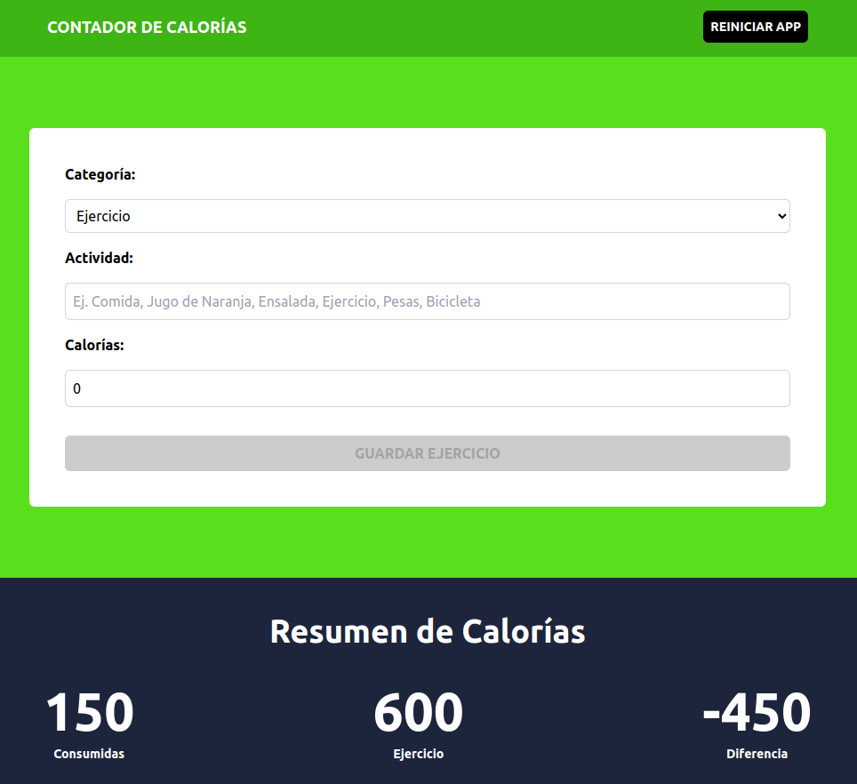

  <h2>Calorie Counter</h2>
  

    Solo Frontend
  

  </img>

## 📜 Description

- Due to its practicality, **Vite** was chosen to initialize, minify, and create the production *bundle*.
- **React**, **TailwindCSS** were used to quickly layout complex components.
- The project is deployed on [**Netlify**](https://astounding-babka-031a90.netlify.app/). Additionally, the final code is dockerized for local testing.

## 🚀 Getting Started

### **Online Version**

Use this [link](https://astounding-babka-031a90.netlify.app/ "Test Demo") to try the code deployed on Netlify.

### **Local Version**
Coming soon ...